A Survey of Level of Aggressiveness on Android Push Notifications

Please answer the questions below. Each question contains one type of push
notifications on Android system. Please grade each type of notifications from 1
to 5 based on their level of aggressiveness:

1 stands for benign and not aggressive at all.

2 stands for disturbing to users but not aggressive.

3 stands for somewhat aggressive.

4 stands for aggressive.

5 stands for extremely aggressive.

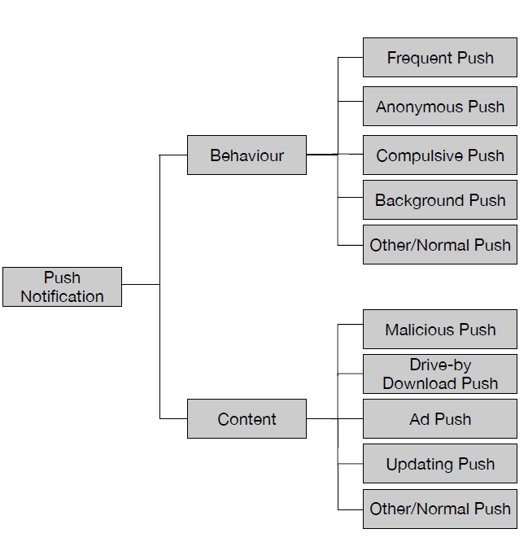

In the survey, we categorize Android push notifications from two divisions:

(1)Pushing behavior, based on the way how notifications are pushed/displayed to
mobile users.

(2)Notification content, based on the actual contents distributed in
notifications (both the contents displayed and the redirected contents after
clicking).

The classification is not completely orthogonal, while it covers most common
cases of push notifications. The actual push notification will belong to at
least one type of behavior pushes and at least one type of content pushes. In
this survey, we divide 23 types of push notifications, based on their content,
into 5 groups. And in each group, we further subdivide each group based on the
bahavior. Each type will be provided with an example screenshot and their
explanation.

-   Group 1 Push with Normal Content

1.  Normal Push: A simple notification with normal, in-app content.

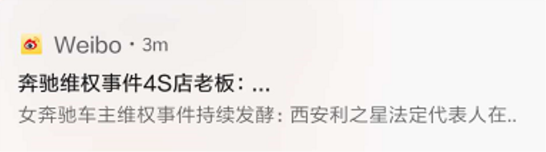

(com.sina.weibo)

1.  Frequent Push: More than 3 notifications with normal, in-app content were
    pushed in 2 minutes.

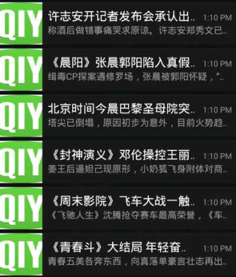

>   (com.qiyi.video.pad)

1.  Compulsive Push: A notification with normal, in-app content that cannot be
    canceled.

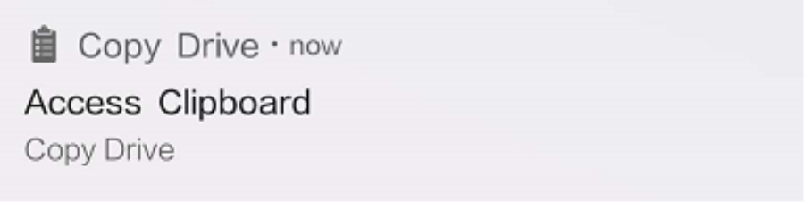

>   (com.ashk.copydrive)

1.  Background Push: A notification with normal, in-app content that was pushed
    when the source app is in the background.

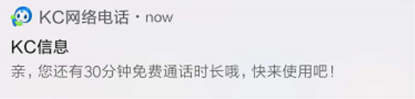

>   (com.keepc)

1.  Anonymous Push: A notification with normal, in-app content that is unclear
    to users of its source app.

>   (com.keramidas.MediaSync)

-   Group 2 Ad Push: a notification that contains advertising content

1.  Ad Push: A notification with advertising content.

>   (com.xieory.XFBlackHole)

1.  Compulsive-Ad Push: A notification with advertising content that cannot be
    canceled.

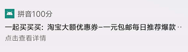

>   (cn.happyeclub.tjraduyy)

1.  Anonymous-Ad Push: A notification with advertising content that is unclear
    to users of its source app.

(com.qihoo.appstore)

1.  Frequent-Ad Push: More than 3 notifications with advertising content were
    pushed in 2 minutes.

>   (tv.i96d197.e9d5fa)

1.  Background-Ad Push: A notification with advertising content that was pushed
    when the source app is in the background.

>   (com.mbs.justin.wallpaper)

-   Group 3 Drive-by Download Push: clicking on this type of notification would
    lead to the direct downloading and installing of another app's apk file
    without user’s secondary confirmation.

1.  Drive-by Download Push: A notification that would triggering unintentional
    downloads once clicked on.

>   (com.broadland.chidgame)

1.  Compulsive-Drive-by Download Push: A notification that would triggering
    unintentional downloads once clicked on, cannot be canceled.

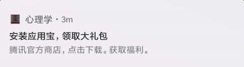

(com.aries.duxin.chenj01)

1.  Anonymous-Drive-by Download Push: A notification that would triggering
    unintentional downloads once clicked on, and is unclear to users of its
    source app.

>   (com.vlocker.theme57ac8f2f1b3a40aa3f8b4637)

1.  Frequent-Drive-by Download Push: More than 3 notifications with drive-by
    download content were pushed in 2 minutes.

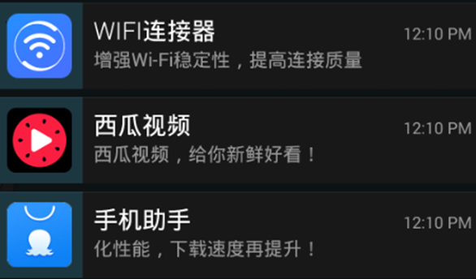

>   (com.kayle.jibuqihtp17)

1.  Background-Drive-by Download Push: A notification with drive-by download
    content that was pushed when the source app is in the background.

>   (cn.o4881.e04d0b)

-   Group 4 Malicious Push: A notification that, after clicked, may jump to
    malicious url or trigger the downloading of malicious files.

1.  Malicious Push: A notification with malicious content.

(com.dobi.incommunicative721)

1.  Compulsive-Malicious Push: A notification with malicious content that cannot
    be canceled.

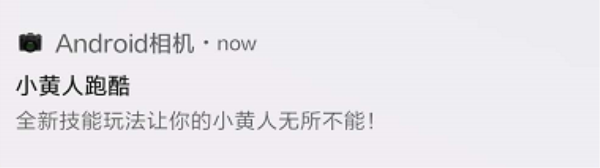

>   (com.bs.vd.wb)

1.  Anonymous-Malicious Push: A notification with malicious content that is
    unclear to users of its source app.

>   (com.keeeweee.lockscreen)

1.  Frequent-Malicious Push: More than 3 notifications with malicious content
    were pushed in 2 minutes.

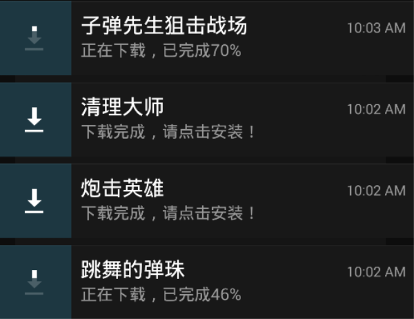

>   (com.broadland.chidgame)

1.  Background-Malicious Push: A notification with malicious content that was
    pushed when the source app is in the background.

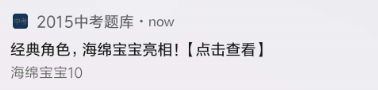

>   (cn.chaojichejian.yoyhen)

-   Group 5 Updating Push: A notification that serves as a reminder of updating
    or downloading app-related resources.

1.  Updating Push: A notification that serves as a reminder of updating or
    downloading app-related resources.

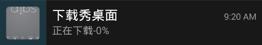

>   (com.baoruan.theme.kmchkeefhLuPwrcreaC)

1.  Compulsive-Updating Push: A notification that serves as a reminder of
    updating or downloading app-related resources, cannot be canceled.

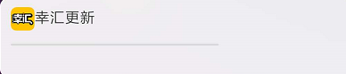

>   (com.ishow.dxh77)

1.  Background-Updating Push: A notification that serves as a reminder of
    updating or downloading app-related resources, and is unclear to users of
    its source app.

>   (vivachina.sport.lemonrunning)
