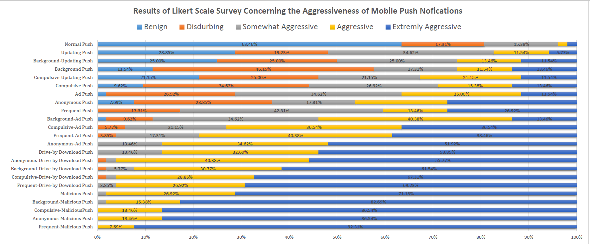
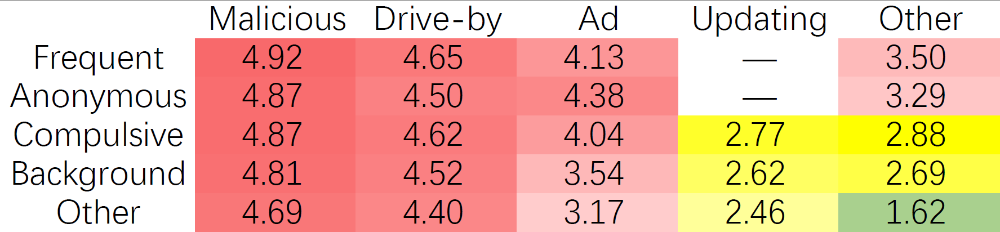

Survey_Result
=============

Results of Likert Scale Survey

The survey results.

The green cell stands for benign and not aggressive at all, the yellow stands
for disturbing to users but not aggressive, and the red ones stand for
aggressive cases, and the deeper the color, the more aggressive it is from
users’ perspective. Overall, 17 ones (in red) are regarded as Aggressive Push
Notifications(APNs).
